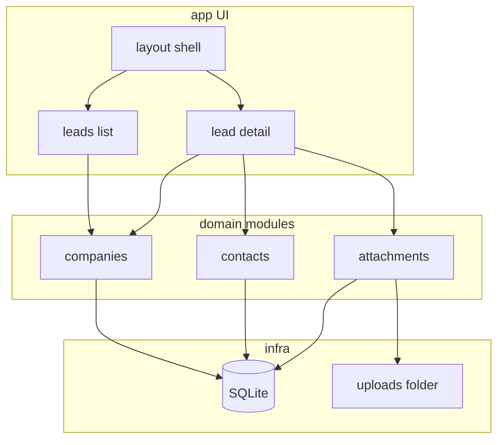

# MyCRM Local PoC (`Library` + `Main`)

Proof-of-concept plan for building a local MyCRM demo from the Word specs in `Library`, without blocking the TMS programming team.

## Workspace layout

```
DALKO CRM/
├── Library/            # existing Word specs (unchanged; source of truth)
├── Main/               # all application code lives here
├── MyCRM-PoC-Plan.md   # build plan
└── Design Rules.md     # theme + UX rules for every new piece
```

Specs stay in `Library`. The runnable product lives only under `Main/`. Before building any UI, follow **[Design Rules.md](Design Rules.md)** (parsed from the designer’s Appearance + General Formatting specs).

## Decisions (locked for this PoC)

- **Stack:** Next.js (App Router) + TypeScript + Tailwind + SQLite + local disk for uploaded files. Fast to run alone; intentionally **not** wired to production TMS/DB.
- **Scope (v1 demo):** MyCRM shell + **Leads list** + **Add/Edit Lead** including **Attachments** (upload, list, rename, delete, view). Prospects deferred (specs are near twins; clone later).
- **Guide docs:** Prefer mature specs — Appearance, Add Lead, Leads. Treat Nov 1 drafts as historical only. Implement UI against **Design Rules.md** so theme/formatting stay consistent.

## Modular architecture inside `Main`



### Folder shape

```
Main/
├── README.md                 # how to run; PoC vs production note
├── package.json
├── prisma/ or src/db/        # schema + migrations (companies, contacts, attachments)
├── public/                   # static assets / logo placeholder
├── uploads/                  # local attachment blobs (gitignored)
└── src/
    ├── app/                  # Next.js routes only (thin)
    │   ├── layout.tsx        # MyCRM top bar + nav
    │   ├── page.tsx          # redirect → /leads
    │   ├── leads/
    │   │   ├── page.tsx      # list
    │   │   └── [id]/page.tsx
    │   └── api/              # route handlers if needed
    ├── components/
    │   ├── shell/            # top bar, nav, footer
    │   ├── leads/            # list filters, table, more menu
    │   └── lead-detail/      # collapsible sections, status flow, upload UI
    ├── domain/               # business rules (status pipeline, required fields)
    │   ├── company.ts
    │   ├── status.ts         # Lead vs Prospect vs Client from status
    │   └── formatting.ts     # ALL-CAPS, phone/date helpers (light PoC versions)
    ├── data/                 # DB access only (repositories)
    │   ├── companies.ts
    │   ├── contacts.ts
    │   └── attachments.ts
    └── lib/                  # shared utils, db client, paths
```

**Rule:** UI components do not talk to SQLite directly; they go through `data/` (and small `domain/` helpers). That keeps the PoC modular and closer to how a real team would grow it.

## Data model (PoC, aligned to Add Lead)

- **Company** — status, lead source, client type, parent, name, industry(s), revenue, website, LinkedIn, territory, salesperson, office, last contact, mailing/physical address, logo path; timestamps
- **Contact** — linked to company (minimal fields for the Contacts section demo)
- **Attachment** — companyId, fileName, storedPath, uploadedBy, uploadedAt
- **Seed user** — single local “demo salesperson” for Uploaded By / Salesperson

Status pipeline from specs: Lead = `New Lead | Contact | Qualify`; crossing to `Present` implies Prospect later (PoC can store the status even if Prospects UI is not built yet).

## UI fidelity (pragmatic, not pixel-perfect)

From Appearance + Add Lead:

- Top bar branded **MyCRM**; nav: Leads (active), Prospects/Clients/Contacts as placeholders
- Lead detail: header with status flow + Save/Back; collapsible sections; implement **Company Information**, **Contacts** (basic), **Attachments** fully; stub other sections (“coming in PoC”)
- Attachments: select files + drag-drop (skip scanner hardware for local PoC); table with View / Rename / Delete; Email action can open a stub toast
- Formatting: ALL-CAPS on blur for text fields; required-field red bar for Client Type, Company Name, Salesperson (and Parent if Subsidiary)

## Out of scope for v1

- Real TMS/DB connection, auth/SSO, scanner devices, mass import/export, Prospects/Clients full screens, permissions matrix, email sending

## Delivery sequence

1. Scaffold `Main` Next.js app + README + `.gitignore` (`uploads/`, `.env`, `node_modules`)
2. Schema + seed data (a few sample leads)
3. Shell layout (nav + branding)
4. Leads list (filter by status/salesperson, open detail)
5. Add/Edit Lead + Company Information + status flow
6. Attachments module (disk + DB + UI)
7. Smoke-check against Add Lead / Leads / Appearance checklists; note gaps for the programming team in `Main/README.md`

## Checklist

- [x] Scaffold Main/ Next.js + TS + Tailwind; README; gitignore uploads
- [x] Add SQLite schema (companies, contacts, attachments) + seed leads
- [x] Build MyCRM shell layout (top bar, nav, footer)
- [x] Implement Leads list page with basic filters and navigation
- [x] Implement Add/Edit Lead with status flow + Company Information
- [x] Implement Attachments upload/list/view/rename/delete
- [x] Document run steps and PoC vs production gaps in Main/README.md

## Handoff value

When the TMS team has bandwidth, `Main` is a clickable reference: routes, domain terms, and attachment flows map to the `Library` specs. They can re-implement against the real stack/DB using the same module boundaries.
